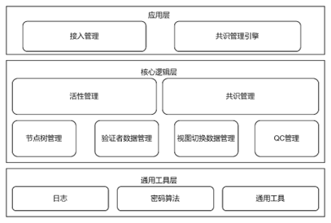

# XBFT共识算法

​	Xbft共识，基于[hotstuff流水线共识算法](./docs/Hotstuff共识算法.md)实现；是一种优化后的三阶段BFT算法，当拜占庭节点数小于共识节点数的1/3时，可以保证系统的安全、高效运行、并提供状态的最终性保证；Xbft当前仅支持共识节点数 >= 4的场景，

​	1) 当创世节点数小于4时，节点无法成功启动；
​   2) 当链上共识节点数量动态减少时，导致链上节点数小于4的交易，执行失败。

​	XBFT在实现过程中，发现当每次都切换leader，下一个被切换的leader可能还没有获取到最新的状态，所以可能下一个共识不能成功，导致共识的稳定性存在问题；因此，根据情况对hotstuff流水线共识算法的基础上进行了如下方面的[优化设计](./docs/Xbft设计文档.md)：

​	1) leader节点不在每次投票后主动切换；
​   2) new-view仅由超时进行触发
​   3) 不再有空块 Dummy block的概念
​	4) 节点广播并收集new-view消息，所有节点共同判断2f+1个new-view后进行视图切换



## 编译安装

### 环境要求

- g++ 8.4.0以上版本
- cmake 3.22以上版本

### 依赖下载

```bash
cd Xbft
mkdir 3rd & cd 3rd & 按照[3rd-install文件](./docs/3rd-install.md)下载需要三方库源码 & cd ..
```

### 编译安装

```bash
mkdir build && cd build
cmake .. -DCMAKE_INSTALL_PREFIX=/usr/local/xbft
make && make install
```

## Xbft使用

- Xbft接口介绍，详见[Xbft接口文档](./docs/Xbft接口文档.md)
- Xbft使用，详见[Xbft使用示例](./docs/Xbft使用示例.md)

## 文档

- [CHANGELOG](./ChangeLog.md)

## 问题反馈

欢迎参与“星火·链网”主链服务的生态建设：

1. 如项目对您有帮助，欢迎点亮我们的小星星(点击项目上方Star按钮)。

2. 欢迎提交代码(Pull requests)。

3. 提问和提交BUG。

4. 邮件反馈：[maxufeng@caict.ac.cn](mailto:maxufeng@caict.ac.cn)

   我们将尽快给予回复。

## 发行说明

各版本更新将记录在CHANGELOG中。

## 许可证

[Apache-2.0](http://www.apache.org/licenses/LICENSE-2.0)

版权所有 2021 中国信息通信研究院工业互联网与物联网研究所