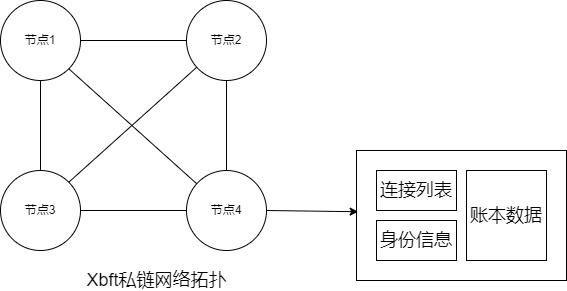
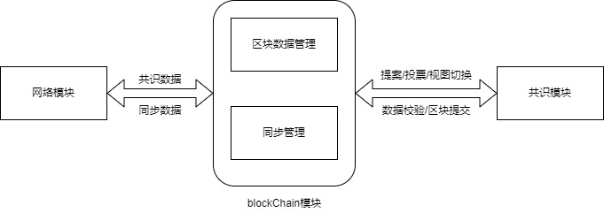

# Xbft共识算法示例介绍

本文档用于Xbft共识算法（下文使用Xbft-sample）使用情况介绍。

## Xbft-sample架构说明

### 网络拓扑说明



Xbft-sample中4节点网络拓扑，节点间通过网络模块进行全连接。

### 节点逻辑架构



节点构建网络模块、blockChain模块，通过[Xbft接口](./Xbft接口文档.md)进行交互。其中：

- 网络模块负责发送并接收共识数据与同步数据；
- blockChain模块负责链数据的处理；
  - 提案数据构建、提案数据验证、提案数据上链
  - 数据同步触发、视图切换触发

- 共识模块为Xbft共识算法，由blockChain构建并调用。

## Xbft-sample编译&安装

Xbft-sample编译安装使用CMake开关进行控制；当BUIKLD_SAMPLE_OPT字段为ON时，则会进行xbft-sample数据的编译&安装（make & make install）；

```
if(NOT DEFINED BUILD_SAMPLE_OPT)
    option(BUILD_SAMPLE_OPT "Build sample" ON)
endif()
```

编译安装完成后，目录结构如下：

```bash
node/
├── include
│   └── xbft
│       ├── ConsEngine.h
│       ├── utils
│       │   ├── FunctionWraper.h
│       │   ├── Logger.h
│       │   ├── Sha256.h
│       │   ├── Strings.h
│       │   ├── Timer.h
│       │   └── Timestamp.h
│       └── Xbft.h
├── lib
│   ├── libxbft.a
│   ├── libxbft.so -> libxbft.so.1.0.0
│   └── libxbft.so.1.0.0
└── test
    ├── sample
    │   ├── node0
    │   │   ├── config.yaml
    │   │   └── xbft-sample
    │   ├── node1
    │   │   ├── config.yaml
    │   │   └── xbft-sample
    │   ├── node2
    │   │   ├── config.yaml
    │   │   └── xbft-sample
    │   └── node3
    │       ├── config.yaml
    │       └── xbft-sample
    └── unittest
        └── xbft-unittests
```

- include为Xbft项目相关头文件
- lib下为Xbft生成的动态库和静态库
- test/sample下为4节点环境（node0-node3）；
  - config.yaml为节点配置；
  - xbft-sample为节点bin文件；

## Xbft-sample使用

### 节点配置说明

```yaml
node:
  private_key: '1031a1213f8ef7517323b7148f4ebf5868e1ffec8f7378ebba29e0150df4ae80' //节点私钥
  interval: 3																	  //节点出块间隔
consensus:
  validators: 																	  //共识验证者列表
    - '562052b1556b50ef69c3599982eab4b0b598dff4'
    - 'da13d50517e11154f0f078abfa4a36d3c57ef694'
    - '3dfae1b75b6cd50601667222c5380ba45c629cf4'
    - '26444cb06f702a345c8c701b520da7f7ef578164'
  interval: 5																	  //共识消息重发时间（提案、视图切换）
net:
  port: 54002																	  //节点网络端口
  bootnode:																		  //引导节点列表
    - 
      consensus_network: '127.0.0.1:54002'										  //引导节点ip:port
      address: '562052b1556b50ef69c3599982eab4b0b598dff4'						  //引导节点地址，用于节点身份确认
    - 
      consensus_network: '127.0.0.1:54003'
      address: 'da13d50517e11154f0f078abfa4a36d3c57ef694'
    - 
      consensus_network: '127.0.0.1:54004'
      address: '3dfae1b75b6cd50601667222c5380ba45c629cf4'
    - 
      consensus_network: '127.0.0.1:54005'
      address: '26444cb06f702a345c8c701b520da7f7ef578164'
logger:
  expire_days: 10																   //节点日志过期时间
  level: DEBUG|WARNING|ERROR|FATAL												   //节点日志级别
  size_capacity: 10																   //日志文件大小
  path: "./log/xbft.log"														   //日志路径
```

### 节点启动

启动 node0

```bash
cd node/test/sample/node0
./xbft-sample
```

启动 node1

```bash
cd node/test/sample/node1
./xbft-sample
```

启动 node2

```bash
cd node/test/sample/node2
./xbft-sample
```

启动 node3

```bash
cd node/test/sample/node3
./xbft-sample
```

### 节点出块

节点全部启动后，看到以下日志说明节点已开始正常出块：

```verilog
[2023-12-06 17:28:11.190240 12916  INFO ] XbftConsensus.cpp:640 id(0) Exec node:view:1,seq:3,hash:ae2c28b2,phash(753d0b24), qhash(753d0b24), lock node:view:1,seq:4,hash:1d8041da,phash(ae2c28b2), qhash(ae2c28b2)
```

### 节点视图切换

Xbft共识算法对hotstuff进行了优化，其中主节点不再主动切换，则需要进行视图切换时，将当前主节点进行中断即可；主节点id = view-number%4；则中断node1即可触发视图切换。随后view-number变为2；其余节点正常进行出块。

```verilog
[2023-12-06 17:32:22.224054 12940  INFO ] XbftLiveness.cpp:144 Replica(2),Received enough new view message, view number will be changed to number(2)
```